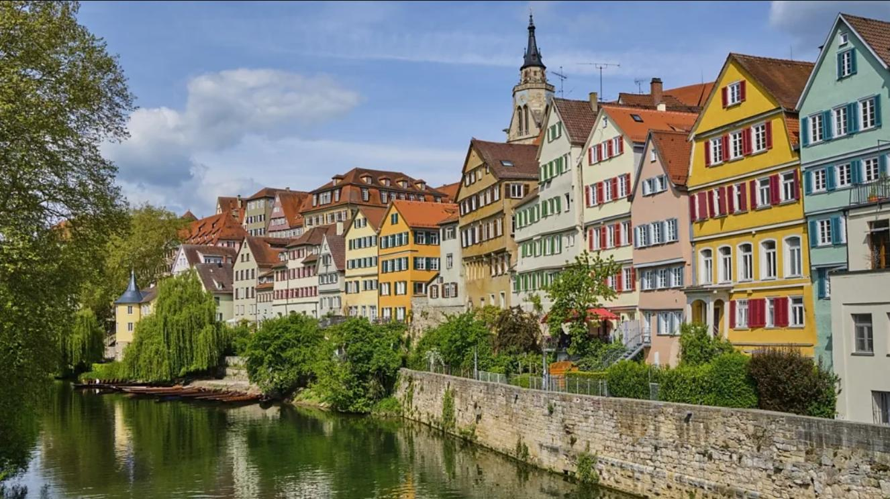

## Short biography

Hi, I'm Luke, or more formally known as Lukas.
I'm a German national with dual citizenship in the US. 
I was born in Wisconsin, USA but grew up in the greater Stuttgart area (Germany), which is known for its car industry and the Swabian dialect.

](assets/reutlingen.jpg){fig-cap="Credit: https://www.nts.eu/en/nts-reutlingen/" alt="Lukas Mayer's hometown - Reutlingen, Germany"}

](assets/stuttgart.jpg){fig-cap="Credit: https://www.tripadvisor.com/Tourism-g187291-Stuttgart_Baden_Wurttemberg-Vacations.html" alt="Lukas Mayer's local city - Stuttgart, Germany"}

After a brief stint working in a closed psychiatric ward at my local university hospital in Tübingen, I decided to pursue undergraduate education at a [small university in beautiful Scotland](https://www.stir.ac.uk). 

{fig-cap="Credit: Westend61/Getty Images" alt="Lukas Mayer's first job was in a closed psychiatric ward at the University Hospital in Tübingen, Germany"}

Despite my initial ambitions to pursue a career in clinical psychology, I discovered my analytical side when I was introduced to computer programming by a PhD student in the lab I was helping out in. I got very lucky in this regard as just prior to graduating, I was offered a summer internship at a London-based Data-Science consultancy. I enjoyed the work as it offered diverse problems to solve from different clients, but ultimately I felt that I should also seek formal education in data analytics. 

](assets/stirling.jpg){fig-cap="Credit: https://www.yopa.co.uk/homeowners-hub/whats-it-like-to-live-in-stirling/" alt="Lukas Mayer's undergraduate university city - Stirling, Scotland"}

The Behavioural and Data Science MSc at the [University of Warwick](https://warwick.ac.uk) was very much the perfect fit for me, as it combined my interest in behavioral research with my newfound passion for select topics in Computer Science. It was at Warwick were I first came to appreciate the application of computational modelling to describe cognitive processes. This was when things "clicked" in my head, and I knew that I wanted to pursue a PhD in this area.

](assets/leamington.jpg){fig-cap="Credit: https://royal-leamington-spa.co.uk/visit/" alt="Lukas Mayer studied at the University of Warwick, which is located near Royal Leamington Spa, England"}

I spent a very fun year working in the Applied Digital Behaviour Lab at the University of [Bath](https://visitbath.co.uk) while preparing my PhD applications and was fortunate to be accepted into the Cognitive Science PhD program at the University of California, Irvine, where I am currently working in [Mark Steyvers' lab](https://steyvers.socsci.uci.edu/madlab/).

{fig-cap="Credit: Ian Woolcock — Shutterstock" alt="Lukas Mayer worked at the business school/management school of the University of Bath - Bath, England"}

](assets/sbsg.jpg){fig-cap="Credit: https://www.undergrad.socsci.uci.edu/ssusa/policies.php)](assets/sbsg.jpg" alt="Lukas Mayer is currently a PhD student in Cognitive Science at the University of California, Irvine, USA"}

## Hobbies and interests

1) **Exercise** - I've always been active as a kid, but when I was younger I somehow never really stuck with any particular sport for too long. To give you an idea, I've had a phase for: archery, badminton, crossfit, golf, parkour, powerlifting, and skateboarding. I'm still interested in strength training, which I have been doing in some form for 10+ years, and badminton. I have limited means to engage with these in an organized format at the moment, so to fill the hole in my heart, I've been investing some time to figure out the perfect home gym setup that still fits inside my bedroom. I think I've been pretty successful with this, so maybe I'll show it off in a post sometime.

\

2) **Technology** - Everyone who has had to deal with me in the last few years knows that I'm fully committed to using GNU/Linux as my daily driver. It's actually quite amazing how much you learn about the inner workings of a computer when you start customizing your setup and ripping out the stuff that's annoying. As you can see, I've also taken an interest in web development. While [Quarto](https://www.quarto.org) admittedly makes this website dead-easy to create, I also use web development in my research to create experiments that run in a browser. I'm super interested in picking up [creative coding](https://openprocessing.org/discover/#/trending) and am hoping to eventually generate some art that I can post on here! :)  

\

3) **Languages** - English used to be my first language as I only started learning German after relocating to [the Länd](https://www.thelaend.de/en/kampagne/) at age six. Maybe because of this experience, I've had a bit of an interest in languages. These days, I do language lessons for fun on [Duolingo](https://www.duolingo.com/profile/luwmayer), where I have a streak of around 2000 days. I'm mostly learning French and Dutch at the moment. My Dutch is definitely better than my French, probably just by virtue of being so similar to German, but both are good enough to follow a Youtube video. I hope to eventually move away from Duolingo and bring my skills to the next level, but don't feel I have the bandwidth for it just now. If you know a good free resource, [be sure to let me know](mailto:willuk@vivaldi.net)!  

\

4) **Gaming** - I was quite the avid gamer as a teen, spending countless hours on the likes of Team Fortress 2, Minecraft and Guild Wars 2. I don't actively play much these days, but I still like to keep up with the industry. Perhaps I'm just waiting for the next big thing to come along. I also really enjoy going to boardgame cafés and completing escape rooms!

\

